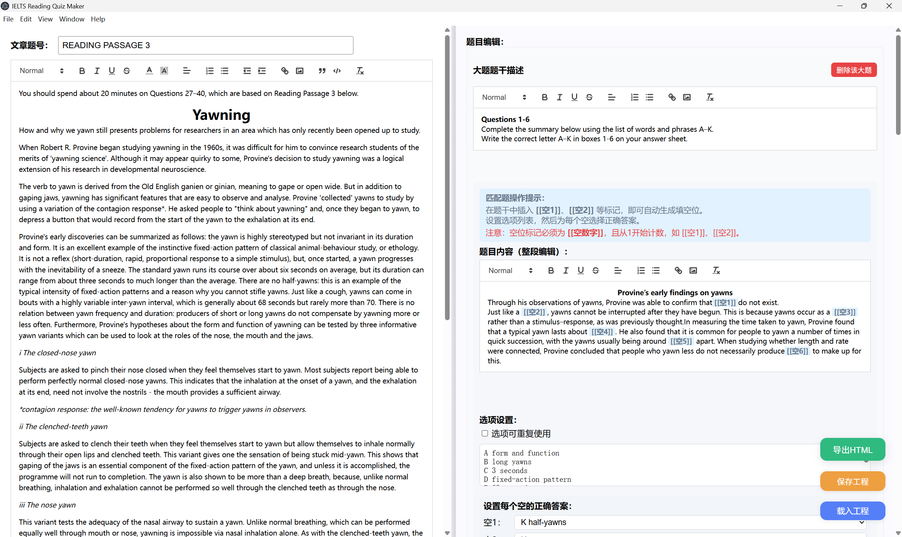
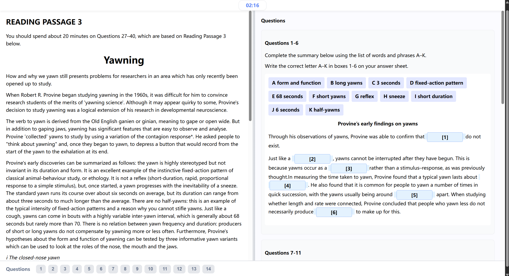

# IELTS Reading Quiz Maker / 雅思阅读试卷生成器

## 项目简介 / Project Introduction

本项目是一个基于 Electron + React 的桌面软件，旨在帮助普通老师（无需编程基础）在 Windows 平台上可视化编辑并批量生成雅思阅读题型的 HTML 网页试卷。学生可直接用浏览器答题，自动评分。

This project is a desktop application based on Electron + React, designed for teachers (no coding required) to visually create and batch-generate IELTS reading HTML quiz pages on Windows. Students can answer directly in browser with auto-grading.


## 软件界面预览 / Screenshots

主界面：


学生答题界面示例：


## 主要功能 / Main Features

- 左文右题分栏布局，所见即所得编辑
- 支持单选、多选、填空、配对等题型
- 自动评分与答案显示
- 一键导出为静态 HTML 文件
- 题号自动编号与导航
- 计时器、批改、重做等功能
- 界面友好，易于上手

## 适用场景 / Use Cases

- 雅思/托福/四六级等阅读题型出卷
- 英语老师日常作业、月考、模拟题批量生成
- 线上线下混合教学、刷题平台内容制作

## Release 下载 / Download Release

你可以直接在 [Releases](https://github.com/DodgeHo/IELTSReadingQuizMaker/releases) 页面下载最新的 Windows 安装包（.exe），一键安装即用。

## 贡献方式 / Contributing

欢迎提交 Issue、PR 或建议！如有需求请在 GitHub Issues 区留言。

## 安装与运行 / Installation & Usage

### 中文说明
1. 安装 [Node.js](https://nodejs.org/)、[Git](https://git-scm.com/)、[VS Code](https://code.visualstudio.com/)
2. 克隆或复制本项目到本地文件夹
3. 依次执行以下命令安装依赖并运行：
   ```shell
   npm install --save react react-dom
   npm install --save-dev electron @electron-forge/cli
   npx electron-forge import
   npm install
   npx webpack
   npm start
   ```
4. 如需导出安装包（.exe），运行：
   ```shell
   npm run make
   ```

### English Instructions
1. Install [Node.js](https://nodejs.org/), [Git](https://git-scm.com/), [VS Code](https://code.visualstudio.com/)
2. Clone or copy this repo to your local folder
3. Run the following commands to install dependencies and start:
   ```shell
   npm install --save react react-dom
   npm install --save-dev electron @electron-forge/cli
   npx electron-forge import
   npm install
   npx webpack
   npm start
   ```
4. To export installer (.exe), run:
   ```shell
   npm run make
   ```

## 开源协议 / License

本项目采用 GPL-3.0 协议，任何衍生作品必须同样开源。
This project is licensed under GPL-3.0. All derivative works must also be open source.

## 联系方式 / Contact

如有建议或需求，请通过 Email 联系。 
For suggestions or requests, please use Issues.
asdsay@gmail.com

业务合作 请联系 Dodge的信号处理代码QQ群 816508289
